# Dental ML Project

[](https://github.com/Harish-nika/Dental_ML_project)

Object detection on dental imagery using models trained and fine-tuned in [Roboflow](https://roboflow.com). This repository documents two YOLOv11 fine-tuned models (tooth and panoramic X-ray tracks), includes training metrics screenshots, and provides runnable inference via the [Roboflow Inference](https://inference.roboflow.com/) SDK (HTTP serverless) and native `inference` package (local weights).

**Repository:** [github.com/Harish-nika/Dental_ML_project](https://github.com/Harish-nika/Dental_ML_project)

The original project goal also includes comparing these Roboflow models with a locally trained Faster R-CNN baseline. That comparison is not implemented in this repo yet; it is listed as future work.

## Models overview

Both models are **YOLOv11 Object Detection (Accurate)** fine-tuned in Roboflow. Folder names `assets/coco` and `assets/yolo` refer to the **tooth** and **pano** training tracks in this project, not COCO-format vs YOLO-format datasets.

| Track | Folder | Roboflow name | Model ID | mAP@50 | Precision | Recall | F1 | License |
|-------|--------|---------------|----------|--------|-----------|--------|-----|---------|
| Tooth | `coco` | tooth 1 | `tooth-bqo56-ez1w4/1` | 87.7% | 89.3% | 80.4% | 84.6% | AGPL-3.0 |
| Pano | `yolo` | pano 1 | `pano-fcjgf-nn0ku/1` | 70.3% | 72.1% | 68.4% | 70.2% | AGPL-3.0 |

- **Pano model (Universe):** [harishnika/pano-fcjgf-nn0ku/model/1](https://universe.roboflow.com/harishnika/pano-fcjgf-nn0ku/model/1)
- **Tooth model:** private workspace model `tooth-bqo56-ez1w4/1` (add Universe link when published)

---

## Tooth model (`assets/coco`)

Focused **tooth-level** detection: cavities, restorations, impactions, and implants on intraoral / periapical-style imagery.

### Classes & dataset (Roboflow)

| Class | Annotation count |
|-------|------------------|
| Cavity | 641 |
| Fillings | 6,097 |
| Impacted Tooth | 498 |
| Implant | 2,047 |

### Validation metrics

Per-class mAP@50 on the validation set (from training curves): **Cavity 71%**, **Fillings 92%**, **Impacted Tooth 90%**, **Implant 97%**; overall mAP ~**88%**.

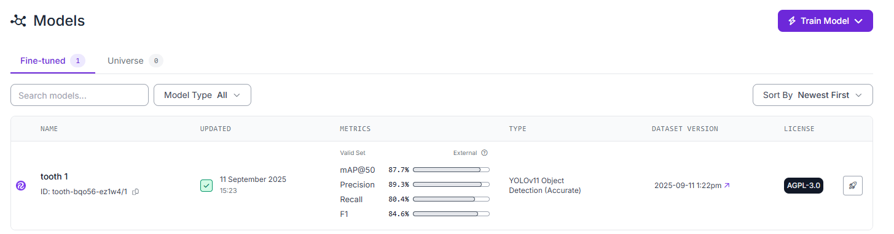

*Roboflow fine-tuned model dashboard for tooth 1.*

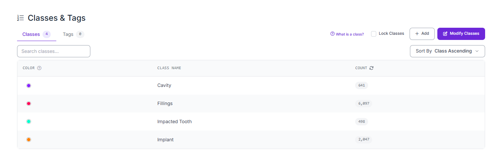

*Classes & tags — four detection classes and label counts in Roboflow.*

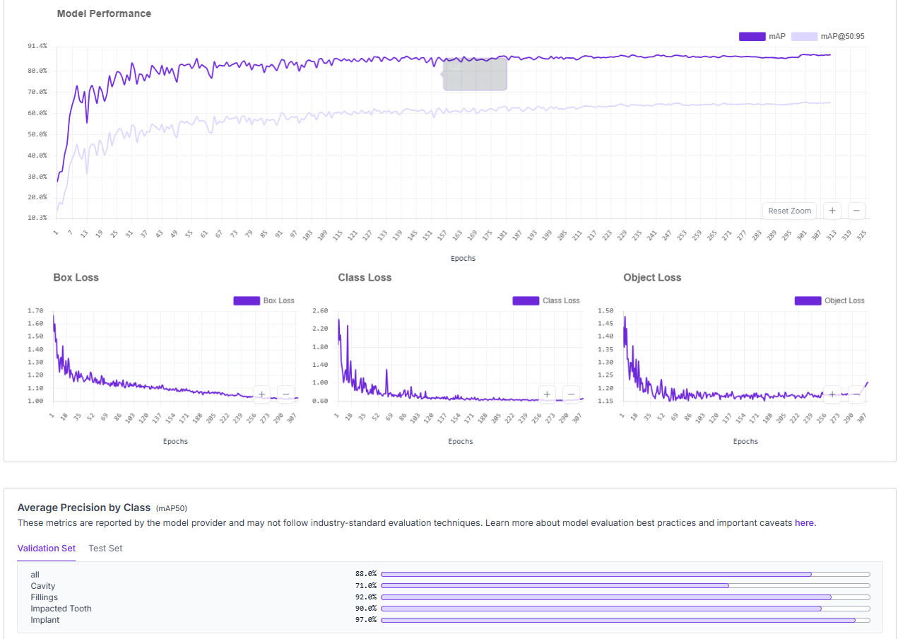

*mAP, loss curves, and average precision by class over training.*

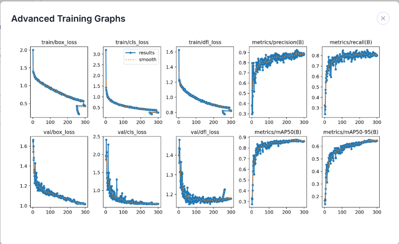

*Extended training metrics for the tooth model.*

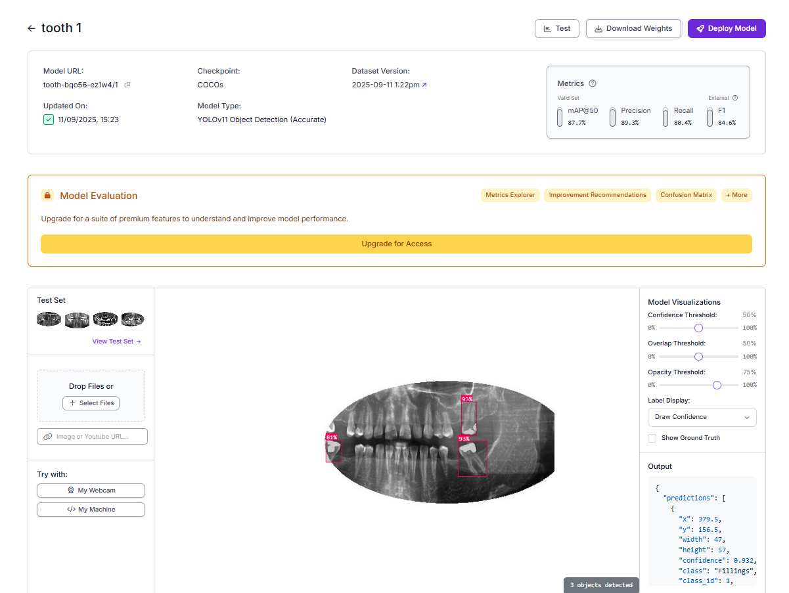

*Fine-tuning configuration used for the tooth model.*

---

## Pano model (`assets/yolo`)

**Panoramic X-ray** object detection across dental conditions and anatomy (caries, fillings, crowns, canals, sinuses, and more).

### Classes & dataset (Roboflow)

14 classes; largest annotation volumes include:

| Class | Annotation count |
|-------|------------------|
| Filling | 55,964 |
| impacted tooth | 32,520 |
| Root Canal Treatment | 25,108 |
| Crown | 14,476 |
| Caries | 13,316 |
| Periapical lesion | 8,104 |
| Missing teeth | 5,108 |
| Root Piece | 4,100 |
| Implant | 2,736 |
| Mandibular Canal | 1,238 |
| maxillary sinus | 924 |

(Additional classes: croen, Malaligned, Retained root — see screenshot below.)

### Validation metrics & inference

Model dashboard mAP@50 **70.3%**; example UI inference highlights **Caries** and **Filling** at 40% confidence on panoramic X-rays.

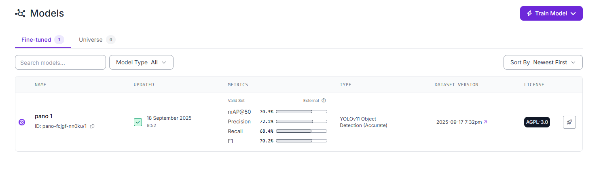

*Roboflow fine-tuned model dashboard for pano 1.*

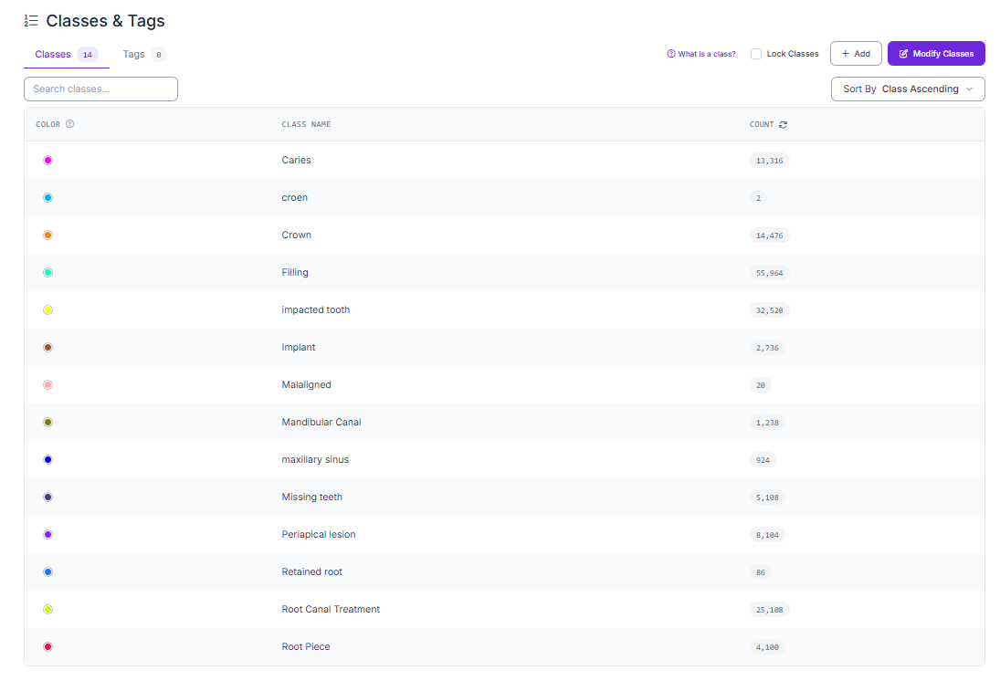

*Classes & tags — 14 pano classes and annotation counts.*

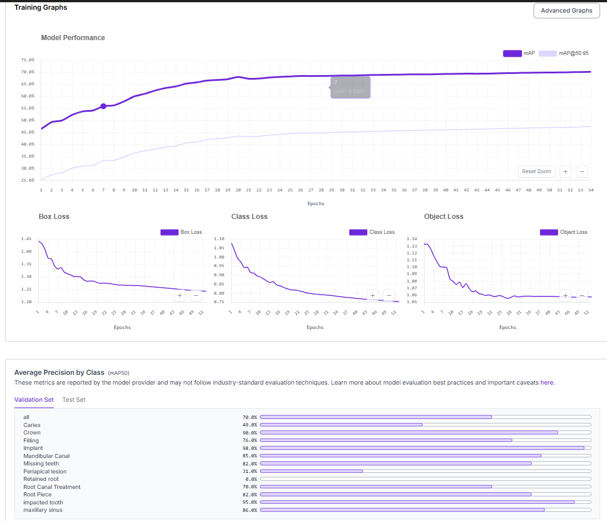

*Training mAP and loss curves for the pano model.*

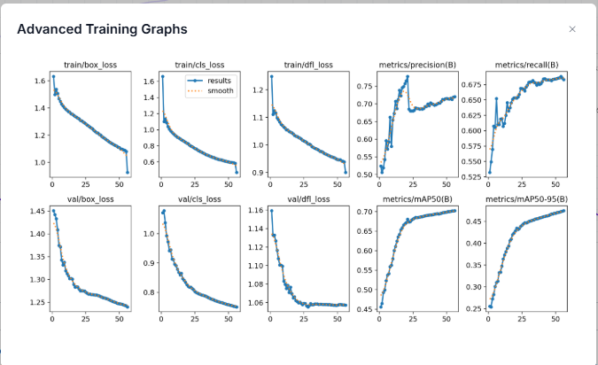

*Extended training metrics for the pano model.*

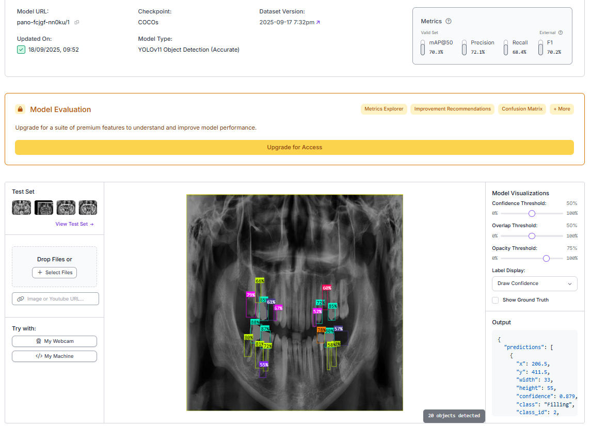

*Fine-tuning configuration for the pano model.*

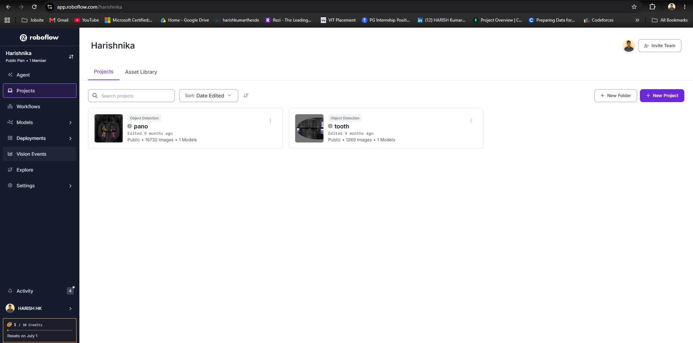

*Annotated dataset preview in Roboflow.*

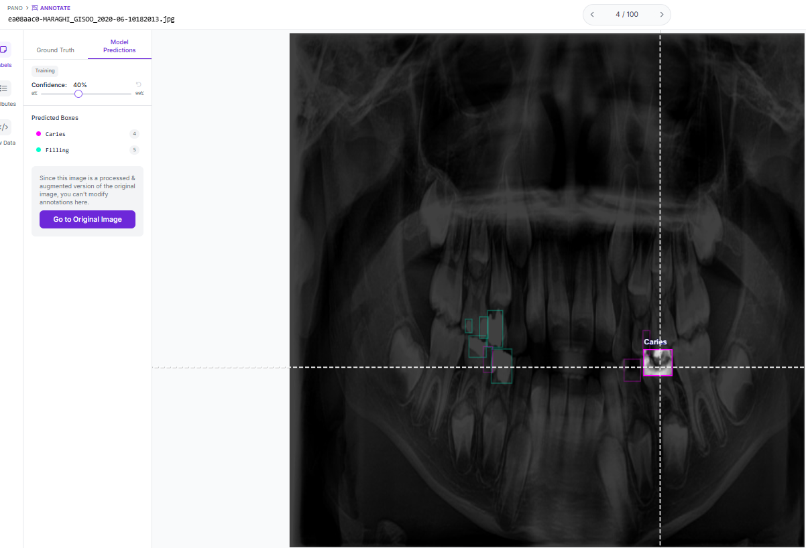

*Example predictions (Caries, Filling) on a panoramic X-ray at 40% confidence.*

---

## Project structure

```
Dental_ML_project/
├── app.py                 # CLI entry point
├── requirements.txt
├── src/
│   ├── config.py          # Model IDs and API key helpers
│   ├── annotate.py        # Load image, annotate, save
│   ├── inference_http.py  # Serverless HTTP inference
│   └── inference_local.py # Local inference (get_model)
├── assets/
│   ├── coco/              # Tooth model screenshots
│   └── yolo/              # Pano model screenshots
└── outputs/               # Annotated images (created at runtime)
```

## Prerequisites

- Python 3.9+
- [Roboflow API key](https://app.roboflow.com/) (required for private fine-tuned models)
- Optional: NVIDIA GPU + CUDA for faster local inference (`inference-gpu` — see [Roboflow install docs](https://inference.roboflow.com/quickstart/run_a_model/))

## Install

```bash
git clone https://github.com/Harish-nika/Dental_ML_project.git
cd Dental_ML_project
python -m venv .venv
source .venv/bin/activate   # Windows: .venv\Scripts\activate
pip install -r requirements.txt
```

For GPU-backed local inference (optional):

```bash
pip install --extra-index-url https://download.pytorch.org/whl/cu124 inference-gpu
```

Adjust the CUDA wheel index to match your installed CUDA version.

## How to use

### 1. Set your API key

Get your API key from the Roboflow dashboard (**Deploy** on your model page).

```bash
export ROBOFLOW_API_KEY=<your_api_key>
```

Or copy the example env file and edit it:

```bash
cp .env.example .env
# Edit .env and set ROBOFLOW_API_KEY
```

Never commit `.env` or real API keys to git.

### 2. Run inference

**HTTP / serverless (recommended default)** — uses [InferenceHTTPClient](https://inference.roboflow.com/quickstart/explore_models/) against `https://serverless.roboflow.com`:

```bash
# Tooth model (coco track)
python app.py --model tooth --image path/to/tooth_image.jpg

# Pano model (yolo track)
python app.py --model pano --image path/to/pano_image.jpg

# Image URL
python app.py --model pano --image https://example.com/xray.jpg

# Custom output path
python app.py --model tooth --image xray.jpg --output outputs/my_result.png

# Show interactive plot
python app.py --model pano --image xray.jpg --display
```

**Local inference** — downloads weights and runs with [get_model](https://inference.roboflow.com/quickstart/run_a_model/):

```bash
python app.py --model pano --image path/to/pano_image.jpg --backend local
python app.py --model tooth --image path/to/tooth_image.jpg --backend local
```

Annotated images are saved under `outputs/` by default (e.g. `outputs/tooth_annotated.png`).

### Self-hosted Inference Server

To use a local Inference Server instead of serverless, set `api_url` in `src/config.py` (e.g. `http://localhost:9001`) and pass it through `run_http_inference` if you extend the CLI, or call `run_http_inference(..., api_url="http://localhost:9001")` from your own script.

## References

- [Run a model (Roboflow Inference)](https://inference.roboflow.com/quickstart/run_a_model/)
- [Fine-tuned private models](https://inference.roboflow.com/quickstart/explore_models/)
- [Pano model on Roboflow Universe](https://universe.roboflow.com/harishnika/pano-fcjgf-nn0ku/model/1)
- [Project repository](https://github.com/Harish-nika/Dental_ML_project)

## Future work

- Local Faster R-CNN training and side-by-side evaluation vs Roboflow YOLOv11 models
- Publish tooth model Universe link when available
